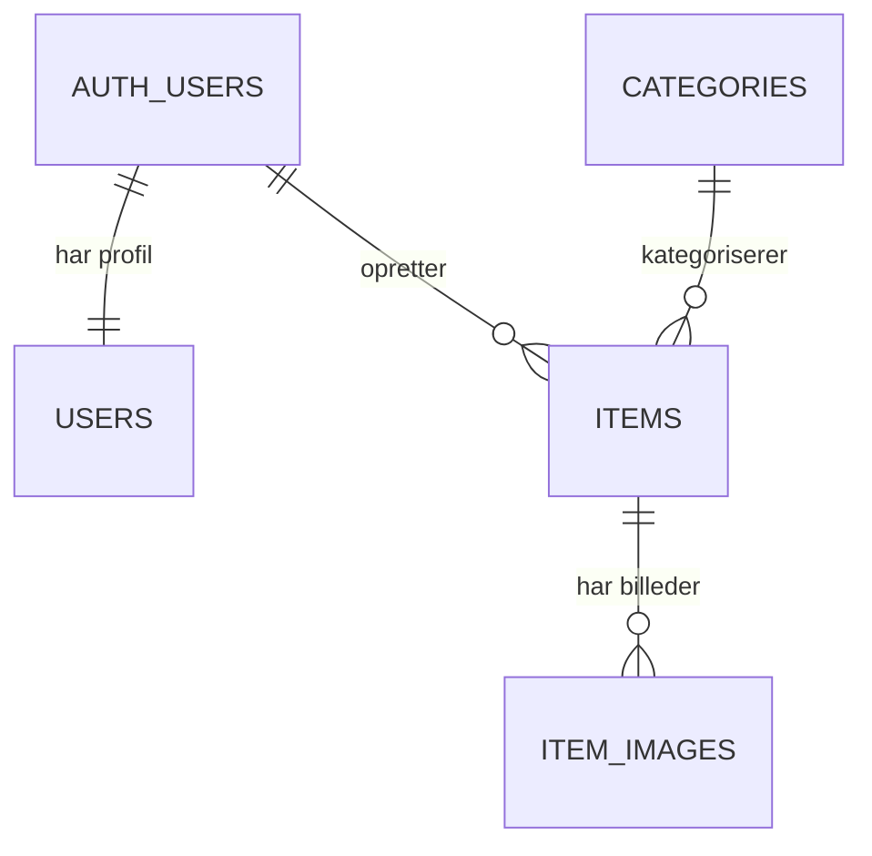

# Hittegodscentralen

Den hurtigste vej mellem taber og finder. Bygget med Next.js, Supabase, Resend og Tailwind CSS.

## Kom i gang

```bash
npm install
npm run dev
```

Åbn [http://localhost:3000](http://localhost:3000) i browseren.

## Database schema

SQL til at oprette hele schemaet (tabeller, enums, triggers, RLS, storage bucket og kategorier) ligger i [`supabase/migrations/20260928000000_init.sql`](supabase/migrations/20260928000000_init.sql). Kør det i Supabase SQL Editor eller med `supabase db push`.

### 1. Samlet tabeloversigt

| Tabel               | Formål                                      |
| ------------------- | ------------------------------------------- |
| `auth.users`        | Supabase login og autentificering           |
| `public.users`      | Brugerprofiler                              |
| `public.categories` | Kategorier for mistede og fundne genstande  |
| `public.items`      | Alle mistede og fundne genstande            |
| `public.item_images`| Billeder tilknyttet opslag                  |



### 2. Schema for hver tabel

#### `auth.users`

Supabases indbyggede tabel. Den skal ikke oprettes manuelt.

| Kolonne      | Type          | Nøgle |
| ------------ | ------------- | ----- |
| `id`         | `UUID`        | PK    |
| `email`      | `TEXT`        |       |
| `created_at` | `TIMESTAMPTZ` |       |

#### `public.users`

Genbrug af den eksisterende `profiles`-tabel, eventuelt omdøbt til `users`.

| Kolonne      | Type          | Nøgle                    |
| ------------ | ------------- | ------------------------ |
| `id`         | `UUID`        | PK, FK → `auth.users.id` |
| `full_name`  | `TEXT`        |                          |
| `phone`      | `TEXT`        | Nullable                 |
| `avatar_url` | `TEXT`        | Nullable                 |
| `created_at` | `TIMESTAMPTZ` |                          |

#### `public.categories`

Kan genbruges næsten direkte fra Ejendelsregisteret.

| Kolonne | Type       | Nøgle              |
| ------- | ---------- | ------------------ |
| `id`    | `SMALLINT` | PK, auto increment |
| `name`  | `TEXT`     | UNIQUE, NOT NULL   |

Eksempler: Elektronik, nøgler, tøj, tasker, dokumenter og andet.

#### `public.items`

Den centrale tabel, som håndterer både mistede og fundne genstande.

En genstand kan oprettes uden bruger. Så er `user_id` null, og kontakt formidles til `contact_email` gennem Hittegodscentralen. Databasen kræver enten `user_id` eller `contact_email`. `contact_email` er skjult for API'et, så læseadgang til `items` gives kolonne for kolonne. Nye kolonner skal derfor tilføjes i `grant select (...)`, før de kan læses.

| Kolonne             | Type               | Nøgle / note                     |
| ------------------- | ------------------ | -------------------------------- |
| `id`                | `UUID`             | PK                               |
| `user_id`           | `UUID`             | FK → `auth.users.id`, Nullable (null = oprettet uden bruger) |
| `contact_email`     | `TEXT`             | Nullable. Påkrævet når `user_id` er null. Kan ikke læses via API'et |
| `category_id`       | `SMALLINT`         | FK → `categories.id`             |
| `type`              | `ENUM`             | `lost` / `found`                 |
| `title`             | `TEXT`             | NOT NULL                         |
| `brand`             | `TEXT`             | Nullable                         |
| `description`       | `TEXT`             | Nullable                         |
| `status`            | `ENUM`             | `active` / `resolved` / `archived` |
| `status_changed_at` | `TIMESTAMPTZ`      |                                  |
| `status_note`       | `TEXT`             | Nullable                         |
| `latitude`          | `DOUBLE PRECISION` | Nullable                         |
| `longitude`         | `DOUBLE PRECISION` | Nullable                         |
| `address`           | `TEXT`             | Nullable                         |
| `postal_code`       | `TEXT`             | Nullable                         |
| `city`              | `TEXT`             | Nullable                         |
| `municipality`      | `TEXT`             | Nullable                         |
| `region`            | `TEXT`             | Nullable                         |
| `country_code`      | `TEXT`             | Fx `DK`                          |
| `occurred_at`       | `TIMESTAMPTZ`      | Tidspunkt mistet/fundet          |
| `created_at`        | `TIMESTAMPTZ`      |                                  |
| `updated_at`        | `TIMESTAMPTZ`      |                                  |

#### `public.item_images`

Genbruges direkte fra det eksisterende schema.

| Kolonne      | Type          | Nøgle                |
| ------------ | ------------- | -------------------- |
| `id`         | `UUID`        | PK                   |
| `item_id`    | `UUID`        | FK → `items.id`      |
| `file_path`  | `TEXT`        | NOT NULL             |
| `file_name`  | `TEXT`        | Nullable             |
| `created_at` | `TIMESTAMPTZ` |                      |
